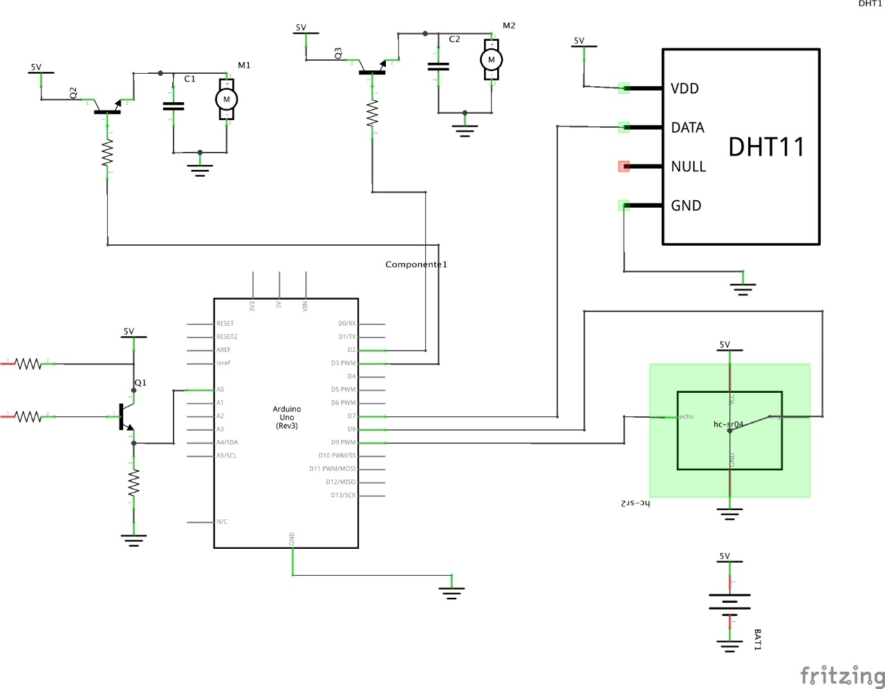
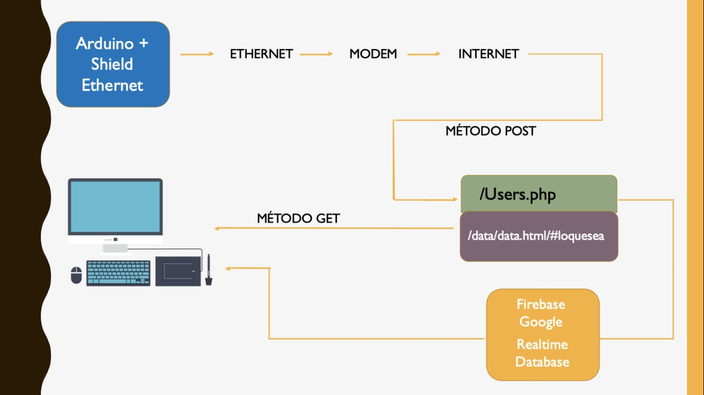

# ProyectoIIE

Hola
Bienvenido al repositorio del proyecto final primer semestre Ingenieria electrónica [Universidad Nacional de Colombia](www.unal.edu.co)

En este repositorio puedes encontrar el código para la implementación de un invernadero automático conectado a internet. El cual almacena la información que proviene de sensores de temperatura, humedad, humedad de la tierra y nivel del tanque de almacenamiento de agua.

El sistema automáticamente registra los valores provenientes de sensores como (DHT11) y un sensor casero que mide la resisitividad de la tierra. Luego El arduino lo envia por medio de Ethernet con metodo POST a un script en php hospedado en 000webhost y de este lo envia a la base de datos (Real Time DataBase de FireBase Google). Cualquier persona en el mundo puede consultar la información suministrada por los sensores desde la siguiente [link](http://proyectoiieagricola.000webhostapp.com).

## Circuiteria y telemática

## Configuración

### Arduino
1. [Instala las librerias de Ethernet](https://aprendiendoarduino.wordpress.com/category/ethernet-shield/)
2. [Instala las librerias del sensor DHT11](https://programarfacil.com/blog/arduino-blog/sensor-dht11-temperatura-humedad-arduino/)
3. [Instala las librerias del sensor SRF04](https://howtomechatronics.com/tutorials/arduino/ultrasonic-sensor-hc-sr04/)
4. Compila y sube
    
### Script PHP
1. [Instala las librerias de firebase para PHP](https://firebase-php.readthedocs.io/en/stable/)
2. Pueba y conecta
    
### Real time Database
1. [Crea una cuenta en firebase](https://firebase.google.com/?hl=es-419)
2. Crea un proyecto en firebase
3. [Crea una Base de datos Real Time Data Base](https://firebase.google.com/docs/database/?hl=es-419)
4. Copia es Script de conexión para Javascript 
5. Comectate y disfruta

## Colaboradores

- Juan Jose Cárdenas Gouvea 
- Daniel Andres Rojas
- Gaia Braccia Polania
- Dairon Stevens Mateus
- Diego Alejandro Sanchez
- Andrés Jejen

El contacto de cada una de estas personas lo encuentras en el siguiente [link](http://proyectoiieagricola.000webhostapp.com/equipo.html).

